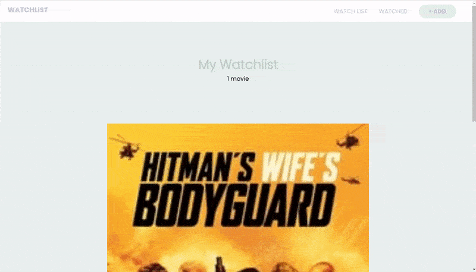

### Create a Movie Watchlist with React Hooks, Context API and localStorage

> In this tutorial we'll be creating a movie watchlist using React, implementing **React Hooks**, **Context API**, **storing data in localStorage** and **fetching data** from an external **API** (The Movie Database).

<br>

##### the tutorial: [Movie Watchlist](https://youtu.be/1eO_hNYzaSc)

[]()

<br>

#### Useful links: 🐖

[fontawesome](https://fontawesome.com/docs/web/use-with/react/)

##### READ MORE ABOUT .env [Using environment variables in a React applicatio](https://adostes.medium.com/using-environment-variables-in-a-react-application-ac3b6c307373)

<br>
<br>

---

<br>
<br>
 
[]()

<br>
<br>

## The counter 🧺

#### This is the last part of the tutorial, here we will be adding a counter, so that the user can see how many movies he has on the counter.

<br>

- Go to the **WatchList.jsx**

```javascript
<h1>My Watchlist</h1>;

<span className="count-pill">{watchlist.length}movies</span>;
```

<br>

##### Now lets add an operator here that will show a plural or singular "movie or movies", depending of how many movies we have on the counter

```javascript
<span className="count-pill">
  {watchlist.length} {watchlist.length === 1 ? "movie" : "movies"}
</span>
```

<br>

##### Result

[]()
