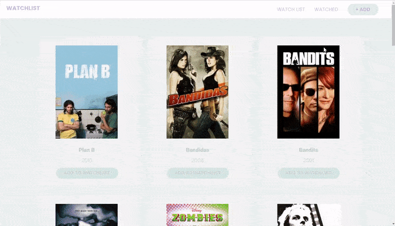
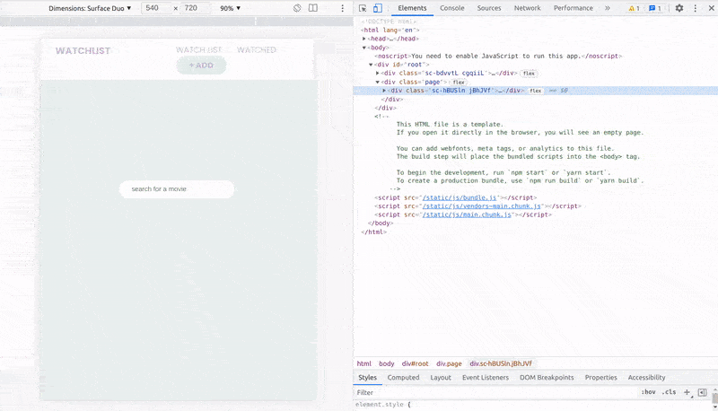
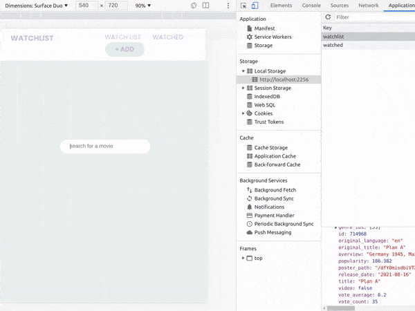
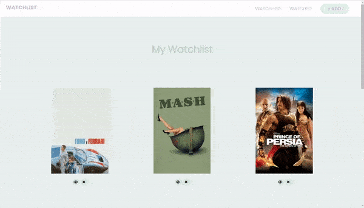
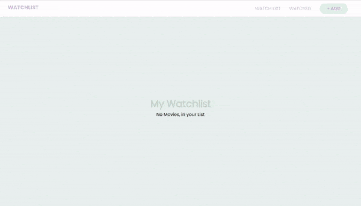
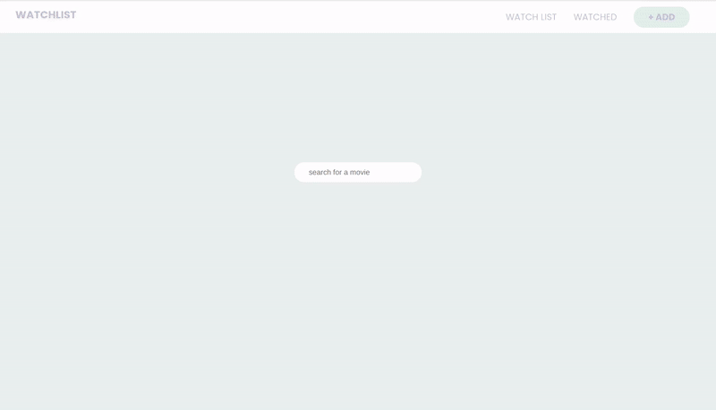
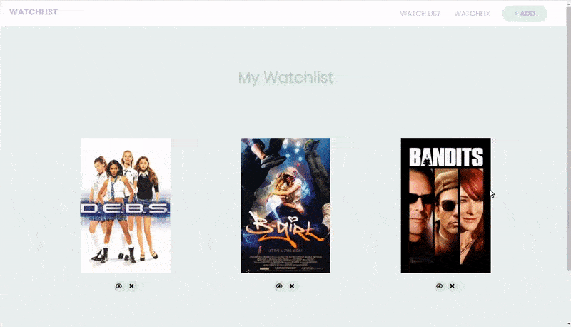
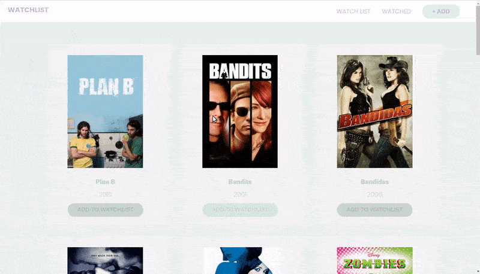
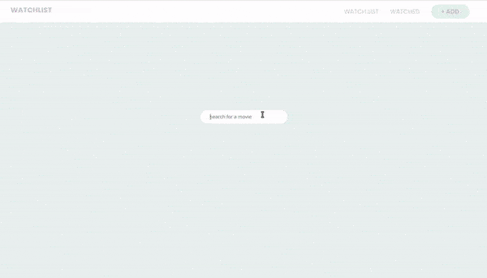
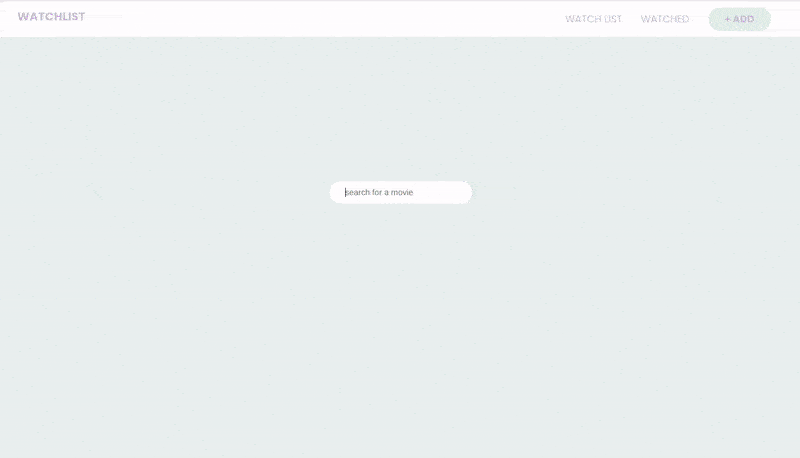

### Create a Movie Watchlist with React Hooks, Context API and localStorage

> In this tutorial we'll be creating a movie watchlist using React, implementing **React Hooks**, **Context API**, **storing data in localStorage** and **fetching data** from an external **API** (The Movie Database).

<br>

##### the tutorial: [Movie Watchlist](https://youtu.be/1eO_hNYzaSc)

[]()

<br>

#### Useful links: 🐖

[fontawesome](https://fontawesome.com/docs/web/use-with/react/)

##### READ MORE ABOUT .env [Using environment variables in a React applicatio](https://adostes.medium.com/using-environment-variables-in-a-react-application-ac3b6c307373)

<br>
<br>

---

<br>
<br>

<br>
<br>

## Saving the Search 🥭

##### Right now when we search for a movie and then we save it, we see that when we refresh it, we lose that watchlist

<br>

- So what we want to do now is that every time we refresh the page, we want our **watchlist** to stay where it is.

<br>

- Go to the context inside the **GlobalState.js** , there use the **useEffect**

<br>

## useEffect

> The useEffect is triggered whenever the **state** is changed inside our provider, so whenever a movie is added to our watchlist, this **useEffect** function here is triggered.

<br>
<br>

## LocalStorage

> We use LocalStorage because we are not using DATABASE

<br>

#### 1. Whenever this useEffect is triggered, we want to save this watchlist to our localStorage

```javascript
useEffect(() => {
  localStorage.setItem("watchlist");
});
//
```

#### ⚠️ 2. local storage has to be a string, so what we are going to do, is to convert this array into a json string, with this: JSON.stringify()

<br>

```javascript
useEffect(() => {
  localStorage.setItem("watchlist", JSON.stringify());
});
//
```

<br>

##### 3. Now inside the JSON.stringify() , we are going to pass what we want actually to convert to a string, in this case, the state.watchlist

<br>

```javascript
useEffect(() => {
  localStorage.setItem("watchlist", JSON.stringify(state.watchlist));
});
```

<br>

#### 4. Then we pass here the state here: }, [state]);, since we are accessing that state

```javascript
useEffect(() => {
  localStorage.setItem("watchlist", JSON.stringify(state.watchlist));
}, [state]);
```

<br>

[]()

<br>
<br>

#### 5. At this moment if we refresh the page, we are not making use of that localStorage yet, so what we are doing next, is that we are going to make that <u>initial state</u> take the value when it first loads from out localStorage items

<br>

- Here **watchlist: [],** we are going to check if there is anything stored in our local storage, so if there is something we are going to return a parsed array, this one: **JSON.parse(localStorage.getItem("watchlist")**, but if there isnt, we are going to return an empty array **: [],** , repeat the same for the **watched**

```javascript
//      BEFORE
//

const initialState = {
  //1 at the beginning we have nothing, its an empty array
  watchlist: [],
  // 2. then we will make the 'watched' component
  // its also going to be empty
  watched: [],
};

//
//
//      AFTER
const initialState = {
  /*
  
  
  Here **watchlist: [],** we are going to check if there is anything stored in our local storage, so if there is something we are going to return a parsed array, this one: **JSON.parse(localStorage.getItem("watchlist")**, but if there isnt, we are going to return an empty array **: [],** , repeat the same for the **watched**
  
  
  */
  watchlist: localStorage.getItem("watchlist")
    ? JSON.parse(localStorage.getItem("watchlist"))
    : [],
  //

  watched: localStorage.getItem("watched")
    ? JSON.parse(localStorage.getItem("watched"))
    : [],
};
```

<br>
<br>

#### 6. Go back to the useEffect and duplicate the line inside and modify it like so:

```javascript
useEffect(() => {
  localStorage.setItem("watchlist", JSON.stringify(state.watchlist));
  //
  //
  localStorage.setItem("watched", JSON.stringify(state.watched));

  //
}, [state]);
//
//
```

<br>
<br>

#### 7. Now with this when we go back and search for a movie and then save, we will notice that when we save a movie, its impossible to re save it and also when we refresh the same movie is disabled, so that we cannot save it again.

<br>

[]()

<br>
<br>
<br>

---

<br>
<br>

# 🍰

## Display the Watchlist

<br>

#### Go to the Watchlist.jsx

> To access the Logic of our **movie Context** inside the **GlobalState.js**, we have to first import the **context**

<br>

## 1. Access the Context ✋

```javascript
import React, { useContext } from "react";
import { GlobalContext } from "../context/GlobalState";
```

<br>

#### 2. Access the watchlist using Context

```javascript
export const WatchList = () => {

  // Accessing the context here:
  const { watchlist } = useContext(GlobalContext);

```

<br>

##### 3. mapping the watchlist from the context

- We can either start the **mapping** inside the **WatchList.jsx** or proceed to create first the **Card** for the WatchList, In my case i will create the card first (I just have to copy the styles and the content of the ResultCard.jsx, then modify it accordingly).

<br>

```javascript
import React from "react";
import styled from "styled-components";
import { mobile, mobileM, tablet } from "../responsive";

//
//
// ** This is the Card linked to Watchlist **
//

const Container = styled.div``;

const Grid = styled.div``;
const ResultCard = styled.div`
  padding: 20px;
  background: #f8f8f8c5;
  padding: 20px;
`;
const ImgBox = styled.div`
  width: 100%;

  img {
    margin: 10px 0 10px 0;
    width: 70%;
    min-height: auto;
    object-fit: cover;
    /* border-radius: 5rem; */
  }
`;
//
const H3 = styled.h3`
  padding: 10px 0 10px 0;
  font-weight: 100;
  font-size: calc(10px + 1.1vmin);
  font-family: "RobotoBlack";
  color: rgb(189, 212, 197);
`;
const H4 = styled.h3`
  font-weight: 100;
  font-size: calc(10px + 1vmin);
  font-family: "Poppins-Light";
  color: rgb(189, 212, 197);
`;
//

//
//
//
const WatchedMovieCard = ({ movie, type }) => {
  return (
    <Container>
      <Grid>
        <ResultCard>
          {movie.poster_path ? (
            <ImgBox>
              {" "}
              
            </ImgBox>
          ) : (
            <div className="filler-poster"></div>
          )}
        </ResultCard>
      </Grid>
    </Container>
  );
};

export default WatchedMovieCard;
```

<br>
<br>

## .map 👍

#### 4. Now lets import the above component and map the card we just created

```javascript
import React, { useContext } from "react";
import { GlobalContext } from "../context/GlobalState";
import WatchedMovieCard from "./WatchedMovieCard";
import styled from "styled-components";
import { mobile, mobileM, tablet } from "../responsive";

//
//
//
//
const WrapperContainer = styled.div`
  width: 100vw;
  min-height: 100vh;
  padding: 0 0 100px 0;
  display: flex;
  justify-content: center;
  align-items: center;
`;
const Container = styled.div``;

//
//
const Content = styled.div`
  width: 100vw;
  min-height: 4vh;
  padding: 0px 0 20px 0;
  text-align: center;
`;

const Ul = styled.ul`
  padding: 5em 7.5em;
  display: grid;
  grid-gap: 2em;
  grid-template-columns: repeat(auto-fit, minmax(260px, 1fr));
`;
//

//
//

export const WatchList = () => {
  //
  // Accessing the context here:
  const { watchlist } = useContext(GlobalContext);

  //
  //
  return (
    <>
      <WrapperContainer>
        <Container>
          <Content>
            <Ul className="results">
              ✋{" "}
              {watchlist.map((movie) => (
                <li key={movie.id}>
                  <WatchedMovieCard movie={movie} type="watchlist" />
                </li>
              ))}
            </Ul>
          </Content>{" "}
        </Container>
      </WrapperContainer>
    </>
  );
};
```

<br>
<br>

# Conditional ? () :

# 🌞

#### 5. Return a message "no movies in the watchlist" using a conditional

- **WatchList.jsx**

<br>

```javascript
{
   ✋ watchlist.length > 0 ? (
    <Ul className="results">
      {watchlist.map((movie) => (
        <li key={movie.id}>
          <WatchedMovieCard movie={movie} type="watchlist" />
        </li>
      ))}
    </Ul>
  ) : (
    <div>No Movies, in your List 👍 </div>
  );
}
```

<br>
<br>

---

<br>
<br>

# 🌵

# Controls

#### 1. In this section we will be handling the controls that will take care of the removing movies or adding to the watchlist

<br>

- Create a new component for the controls, call it: **MovieControls.jsx**

<br>

- Pass the props: **movie and type** , just like we did with the card above

<br>

```javascript
//
const MovieControls = ({ movie, type }) => {
  return (
    <>
      <WrapperContainer>
        <Container>
          <Content>
            {type === "watchlist" && (
              <>
                <button className="ctrl-btn">
                  <i className="fa-fw far fa-eye"></i>
                </button>
                {/*  */}
                <button className="ctrl-btn">
                  <i className="fa-fw fa fa-times"></i>
                </button>
              </>
            )}
          </Content>
        </Container>
      </WrapperContainer>
    </>
  );
};
```

<br>
<br>

#### 2. Import the component above inside the WatchedMovieCard.jsx

<br>

```javascript
import MovieControls from "./MovieControls";
```

- Use it here:

```javascript

          <MovieControls type={type} movie={movie} />
        </ResultCard>
```

[]()

<br>
<br>

#### Before implementing the removing functionality, this is what we have [button data](./button.md) ✋

<br>
<br>
<br>

## Removing movie

<br>

- To remove the movie we will need to make an **action**, so lets go back to the **GlobalState.js**

#### 3. create a new dispatch type, as we did in step 8 of the GlobalState.js file

```javascript
// ------- actions ----------
//10 action related to the removal of the movie in the watchlist
//here we dont need the full movie , we just need the id
const removeMovieFromWarchlist = (id) => {
  dispatch({ type: "REMOVE_MOVIE_TO_WATCHLIST", payload: id });
};
```

<br>

#### 4. now we need to bring this function: removeMovieFromWarchlist, to be exported in the GlobalContext.Provider, so that this too can be accessed from other components

<br>

```javascript
 return (
    <GlobalContext.Provider
      value={{
        watchlist: state.watchlist,
        watched: state.watched,
        addMovieToWatchlist,
        removeMovieFromWarchlist, ✋
      }}
    >
      {props.children}
    </GlobalContext.Provider>
  );
```

<br>
<br>

#### 5. Once this is done we need to tell the Reducer what to do, so lets go to the AppReducer.js

- this is going to return all of the movies that are not equal to the id we are passing here below from the state

```javascript
✋
 // related to movie removal btn
    case "REMOVE_MOVIE_TO_WATCHLIST":
      return {
        // 1
        ...state,
        //2
        // this is going to return all of the movies that are not equal
        // to the id we are passing here below from the state
        watchlist: state.watchlist.filter(
          (movie) => movie.id !== action.payload
        ),
      };

    //
```

<br>
<br>

#### 6. now that we have the action in both 'the appReducer and the GlobalState', we can add it inside the MovieControl.js

<br>

- import react contex

```javascript
import React, { useContext } from "react";
import { GlobalContext } from "../context/GlobalState";
```

<br>

##### 7. now we need to grab that action from the context

```javascript
const { removeMovieFromWarchlist } = useContext(GlobalContext);
```

<br>

- Now use the **removeMovieFromWarchlist** on the button

<br>

[]()

<br>
<br>

---

<br>
<br>

# 🌈

## Watched component 👁️

#### In this section we will create another action in our global state, this action will handle the moving of a movie from our watchlist to our watched component

<br>

- 1. Import the following inside the **Watched.jsx** component

<br>

```javascript
import React, { useContext } from "react";
import { GlobalContext } from "../context/GlobalState";
import WatchedMovieCard from "./WatchedMovieCard";
```

<br>

#### 2. Add the following from the Watchlist.jsx

```javascript
<>
  export const Watched = () => {
  //
  //
  const { watched } = useContext(GlobalContext); ✋

  //
  //
  return (
    <>
      <WrapperContainer>
        <Container>
          <Content>
            <h1>Watched Movies</h1>

         ✋   {watched.length > 0 ? (
              <Ul className="results">
              ✋  {watched.map((movie) => (
                  <li key={movie.id}>
                    <WatchedMovieCard movie={movie} type="watched" />
                  </li>
                ))}
              </Ul>
            ) : (
              <div>No Movies, in your List</div>
            )}
          </Content>{" "}
        </Container>
      </WrapperContainer>
    </>
  );
};
</>
```

<br>
<br>

#### 3. Go to the GlobalState.jsx

👍 check the **action 11** , this is the one we are implementing now

```javascript
// 8 ACTION
//   this is going to be provided with the movie data here: (movie) =>
const addMovieToWatchlist = (movie) => {
  dispatch({ type: "ADD_MOVIE_TO_WATCHLIST", payload: movie });
};
//
//10 action related to the removal of the movie in the watchlist
//here we dont need the full movie , we just need the id
const removeMovieFromWarchlist = (id) => {
  dispatch({ type: "REMOVE_MOVIE_TO_WATCHLIST", payload: id });
};

//11 action to move the movie from watchlist to watched
const addMovieToWatched = (movie) => {
  dispatch({ type: "ADD_MOVIE_TO_WATCHED", payload: movie });
};
//
```

<br>

#### 4. Now pass it inside the Global Context to expost it everywhere else

```javascript
  return (
    <GlobalContext.Provider
      value={{
        watchlist: state.watchlist,
        watched: state.watched,
        addMovieToWatchlist,
        removeMovieFromWarchlist,
        addMovieToWatched, ✋
      }}
    >
      {props.children}
    </GlobalContext.Provider>
  );
  //
```

<br>
<br>

#### 5. Now handle the case inside the AppReducer.js

- READ THE COMMENTs

```javascript
    case "ADD_MOVIE_TO_WATCHED":
      return {
        // 1
        ...state,
        //2
        //here we need to remove a movie from the watchlist
        //and then we need to add it to the watch component
        watchlist: state.watchlist.filter(
          //action.payload.id this is going to return the movies,
          //that  arent equal to the new movies we are adding.
          //so its removing it from the watchlist
          (movie) => movie.id !== action.payload.id
        ),
        //3 then after removing from the watchlist in step 2, we want to add it
        //to the watched list, as you notice, the line
        //below is similar to the one in the case "ADD_MOVIE_TO_WATCHLIST":
        watched: [action.payload, ...state.watched],
        //
        //
      };
```

<br>

#### 6. Go back to the MovieControls.jsx and add the function _addMovieToWatched_ (where the yellow hands are)

<br>

```javascript
const MovieControls = ({ movie, type }) => {
  //
  //

  const { removeMovieFromWarchlist, addMovieToWatched ✋ } =
    useContext(GlobalContext);
  //
  //
  return (
    <>
      <WrapperContainer>
        <Container>
          <Content>
            {type === "watchlist" && (
              <>
                <button
                  className="ctrl-btn"
                  onClick={() => ✋ addMovieToWatched(movie)}
                >
                  <i className="fa-fw far fa-eye"></i>
                </button>
                {/*  */}
                <button
                  className="ctrl-btn"
                  onClick={() => removeMovieFromWarchlist(movie.id)}
                >
                  <i className="fa-fw fa fa-times"></i>
                </button>
              </>
            )}
          </Content>
        </Container>
      </WrapperContainer>
    </>
  );
};
```

<br>
<br>

#### result of 'add movie to watched'

<br>

[]()

<br>
<br>

## Watched Controls

##### 7. Now we want to be able to move it back to our watchlist

- For this to work we will need to work on 2 more actions as we have 2 buttons

```javascript
{
  type === "watched" && (
    <>
      <button className="ctrl-btn">
        <i className="fa-fw far fa-eye-slash"></i>
      </button>
      // ------------------ //
      <button className="ctrl-btn">
        <i className="fa-fw fa fa-times"></i>
      </button>
    </>
  );
}
```

<br>
<br>

#### 8. Add the Actions for the buttons from above

- Here we will repeat the same procedure for the actions, so the actions here below (the 12 and 13) are the ones I am focusing.

```javascript
//12 action: move to watchlist ✋
const movieToWatchlist = (movie) => {
  dispatch({ type: "MOVE_TO_WATCHLIST", payload: movie });
};
//
//13 action: remove from watched ✋
const removeFromWatched = (id) => {
  dispatch({ type: "REMOVE_FROM_WATCHED", payload: id });
};
// 7 wrap with the GlobalContext.Provider, so that we can access the global context from every component
return (
  <GlobalContext.Provider
    value={{
      watchlist: state.watchlist,
      watched: state.watched,
      addMovieToWatchlist,
      removeMovieFromWarchlist,
      addMovieToWatched,
      //
      movieToWatchlist, ✋
      removeFromWatched, ✋
    }}
  >
    {props.children}
  </GlobalContext.Provider>
);
//
//
```

<br>
<br>

#### 9. Now lets go to the AppReducer.js

```javascript
  //
    //------------------------------------
    //
    case "MOVE_TO_WATCHLIST":
      return {
        // 1
        ...state,
        //2

        watched: state.watched.filter(
          (movie) => movie.id !== action.payload.id
        ),
        //  this will add the movie back to our front of the watchlist
        watchlist: [action.payload, ...state.watchlist],
        //
        //
      };
    //
    //

    case "REMOVE_FROM_WATCHED":
      return {
        // 1
        ...state,
        //2
        watched: state.watched.filter((movie) => movie.id !== action.payload),

        //
        //
      };
    //
    //
```

<br>
<br>

#### 10. We can now use it inside the MovieControls.jsx

- import it

```javascript
const MovieControls = ({ movie, type }) => {
  //
  //

  const {
    removeMovieFromWarchlist,
    addMovieToWatched,
    movieToWatchlist,
    removeFromWatched,
  } = useContext(GlobalContext);
  //
  //
  return (
```

<br>

- And implement it here:

```javascript
{
  type === "watched" && (
    <>
      <button className="ctrl-btn" onClick={() => movieToWatchlist(movie)}>
        <i className="fa-fw far fa-eye-slash"></i>
      </button>
      <button className="ctrl-btn" onClick={() => removeFromWatched(movie.id)}>
        <i className="fa-fw fa fa-times"></i>
      </button>
    </>
  );
}
```

<br>
<br>

---

<br>
<br>

# 🍰

### 11. Prevent having the same movie inside the options when looking for movies

<br>

> Here I add all the movies inside the watchlist into the watched, then at the end of the gif sequence, I go the search bar to add more movies, So when I look for all movies starting with **B**, I can still see I have the **Bandits movie** in the options, even if I already have it saved in the watched.

<br>

#### why should we add twice the same movie in our lists?

<br>

[]()

<br>
<br>

### Lets prevent that!

<br>

> Go to the **ResultCard.js** and add some rules there ✋, we need to give it some specification to not only look for the watchlist, but the other lists as well.

<br>

##### Before

```javascript
//3 disabled the possibility to duplicate a movie in the watchlist

const watchlistDisabled = storedMovie ? true : false;
/*
 this is going to be disabled if we have a movie inside the
  watchlist, so if we have a similar movie in the watchlist 
  it s going to be true, which means it s going to disabled
  the option to save it, but if it s false, meaning that we 
  dont have a similar movie in the watchlist, then it s going
  to show the option to save the movie.
 */
```

<br>

##### after ✋

- So as the comment above describe it, this is disabling the button whether or not its appearing in **the watchlist but we also want to check if its in the watched list as well**

<br>

#### ResultCards.jsx

<br>

#### 12. Create a another variable to handle that

- Here we will look inside the **watched array** to look for the movie: **watched.find()**

```javascript
let storedMovieWatched = watched.find((o) => o.id === movie.id);
```

<br>

##### 🔴 you will see that _watched_ is undefined

- To solve it: Just import the **watched array** here:

<br>

```javascript
//1 not duplication
const { addMovieToWatchlist, watchlist, watched ✋ } = useContext(GlobalContext);
```

<br>

#### 13. Now we want to disabled the button if its inside the the watchlist but we also want to check if it s stored in the watched list so to disabled it as well!.

<br>

- Lets add another if statement here

##### make some changes to the following line in the ResultCards.jsx:

```javascript
//                BEFORE
  //3 disabled the possibility to duplicate a movie in the watchlist

  const watchlistDisabled = storedMovie ? true : false;
  /*
 this is going to be disabled if we have a movie inside the
  watchlist, so if we have a similar movie in the watchlist
  it s going to be true, which means it s going to disabled
  the option to save it, but if it s false, meaning that we
  dont have a similar movie in the watchlist, then it s going
  to show the option to save the movie.


```

<br>

#### Change it like so:

<br>

```javascript
//                AFTER
  //3 disabled the possibility to duplicate a movie in the watchlist

  const watchlistDisabled = storedMovie
    ? true
    : storedMovieWatched
    ? true
    : false;
  /*
 this is going to be disabled if we have a movie inside the
  watchlist, so if we have a similar movie in the watchlist
  it s going to be true, which means it s going to disabled
  the option to save it the same for the storedMovieWatched, but if it s false, meaning that we
  dont have a similar movie in the watched list, then it s going
  to show the option to save the movie as it will mean its false

```

<br>

##### Here below you can see, that when I added the 3 new movies at the end it s impossible to add it again.

<br>

[]()

<br>
<br>

---

<br>

# 🍰

### Now lets implement one more button

- This button will show the button to add to the watchlist and the button to add to watched, so that you can choose to which list you want it to be added from the beginning

#### 1 import the action: addMovieToWatched

```javascript
//1 not duplication
const { addMovieToWatchlist, watchlist, watched, addMovieToWatched } =
  useContext(GlobalContext);
```

<br>

#### 2. so to use it in the new button here below:

```javascript
<Button disabled={watchlistDisabled} onClick={() => addMovieToWatched(movie)}>
  add to watched
</Button>
```

<br>

#### Now we will have both buttons, but as you can see in the gif, there is something wrong when we click in either button.

- So if you notice both buttons get clicked , when i only want one at the same time

<br>

[]()

<br>

#### Create this variable

```javascript
//7 related to the 2 buttons
const watchedDisabled = storedMovieWatched ? true : false;
```

<br>

##### then use it here: disabled={watchedDisabled}

```javascript
<Button disabled={watchedDisabled} onClick={() => addMovieToWatched(movie)}>
  add to watched
</Button>
```

### now test it ✋

<br>

[]()
