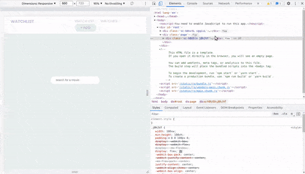

### Create a Movie Watchlist with React Hooks, Context API and localStorage

> In this tutorial we'll be creating a movie watchlist using React, implementing **React Hooks**, **Context API**, **storing data in localStorage** and **fetching data** from an external **API** (The Movie Database).

<br>

##### the tutorial: [Movie Watchlist](https://youtu.be/1eO_hNYzaSc)

<br>

## Useful links: 🐖

[fontawesome](https://fontawesome.com/docs/web/use-with/react/)

<br>

#### READ MORE ABOUT .env [Using environment variables in a React applicatio](https://adostes.medium.com/using-environment-variables-in-a-react-application-ac3b6c307373)

<br>
<br>

---

<br>
<br>

## CONTEXT API 🍨

<br>
<br>

#### Now that we have the products showing on the screen when we type something

[]()

<br>

```javascript
<H4>{movie.release_date ? movie.release_date.substring(0, 4) : "-"}</H4>
```

<br>
<br>
<br>

# 🥭

## Implementing the "STORE"

<br>

- What we are going to build now is called the **store** , the **store** will hold all the state data, **the store holds the object which holds the application state data**

- After that we will need the **reducer**

<br>

### Let's implement the watchList component and the button:

<br>

- For this we are going to use the Context API so that we can reach this from everywhere in the project.

<br>

> We do this because the only way we can reach the data in all the components is through **props** but if we do it with it, it will take a lot of time, so that is why we are going to use **context api**

<br>

### Create a new folder (inside the src) and call it

- context

- inside the context folder, create a new file and call it: **GlobalState.js**

<br>

#### 1. Import the following:

```javascript
import React, { createContext, useReducer, useEffect } from "react";
```

<br>

#### 2. Handle the initial state

- the first thing you have to do when working with context api, is making an **initial value**

```javascript
const initialState = {
  //a. at the beginning we have nothing, its an empty array
  watchlist: [],
  //
  // b. then we will make the 'watched' component
  // its also going to be empty
  watched: [],
};
```

<br>

#### 3. Create Context

```javascript
//c. CREATE CONTEXT
export const GlobalContext = createContext(initialState);
```

<br>

#### 4. Now in order to provide this context we need to use something called <u>Provider</u> , which basically allow us to access this global context from other variables

<br>

```javascript
export const GlobalProvider = (props) => {
  // 5 here we will set up the stuff to make it functional
};
```

<br>

#### 5. Make the Provider Functional

##### 🔴 at this point we will have an error, because we don't have yet the <u>AppReducer</u>, thats why it will tell that AppReducer is undefined.

```javascript
export const GlobalProvider = (props) => {
  //
  const [state, dispatch] = useReducer(AppReducer, initialState);
};
```

<br>
<br>

#### This is what we have until now:

```javascript
//1
import React, { createContext, useReducer, useEffect } from "react";
//
//2
const initialState = {
  //1 at the beginning we have nothing, its an empty array
  watchlist: [],
  //
  // 2. then we will make the 'watched' component
  // its also going to be empty
  watched: [],
};
//
//
//3 CREATE CONTEXT
export const GlobalContext = createContext(initialState);

//
//4 provider is going to allow us to access this global context from other variables

export const GlobalProvider = (props) => {
  const [state, dispatch] = useReducer(AppReducer, initialState);
};
```

<br>
<br>

## The Reducer

#### How do actions and reducers Work?

> In Redux, a reducer is a pure function that takes an action and the previous state of the application and returns the new state. The action describes what happened and it is the reducer's job to return the new state based on that action. It may seem simple, but it does have to be a pure function with no side effects.

<br>

#### 6. Create the AppReducer file inside the <context> folder

- AppReducer.js

##### The Reducer is basically a function that returns some state data, this basically describes how your state is transfered into the next state

- In other words, the **reducer** will tell the **store** what to do with the data

> **(actions are objects that tells the reducer how to change the state)**

<br>

```javascript
export default (state, action) => {
  // here we are dispatching a type, that then passes it to the reducer here
  switch (action.type) {
    default:
      return state;
  }
};
```

<br>

##### import the AppReducer.js inside the GlobalState.js

```javascript
import { AppReducer } from "./AppReducer";
```

<br>

## [Provider](https://react-redux.js.org/api/provider)

> The **< Provider >** component makes the Redux store available to any nested components that need to access the Redux store.

<br>

#### 7. With the GlobalContext.Provider, we will wrap all of the elements of the application, so that we can access the global context from every component

```javascript
export const GlobalProvider = (props) => {
  // 5
  const [state, dispatch] = useReducer(AppReducer, initialState);

  // 7 wrap with the GlobalContext.Provider all of the elements of the application
  // so that we can access the global context from every component
  return <GlobalContext.Provider>{props.children}</GlobalContext.Provider>;
  //
  //
};
```

<br>

#### 8. Provide a value so that they are available from our provider, so inside here we want to provide:

- watchlist:

```javascript
 value={{ watchlist: state.watchlist }}
```

<br>

#### So its basically returning the <u>watchlist</u> from the state, and then we will also want to provide it with the <u>watched:</u>

```javascript
// 7 wrap with the GlobalContext.Provider all of the elements of the application so that we can access the global context from every component
return (
  <GlobalContext.Provider
    value={{ watchlist: state.watchlist ✋ , watched: state.watched ✋}}
  >
    {props.children}
  </GlobalContext.Provider>
);
```

<br>
<br>

## Actions

> The action describes what happened and it is the reducer's job to return the new state based on that action. It may seem simple, but it does have to be a pure function with no side effects.

<br>

#### 9. 🍍 When we will click this <u>Add to watchlist</u> button, we need to tell the provider, to use an action "to tell it what to do with it once we click the button"

<br>

- So what we want to do with this action, is to create a function here and we're gonna call it **addMovieToWatchlist**

```javascript
//  ACTION
//   this is going to be provided with the movie data here: (movie) =>
const addMovieToWatchlist = (movie) => {};
```

<br>

#### 10. Then we are going to dispatch an "action". we are going to dispatch a type

```javascript
const addMovieToWatchlist = (movie) => {
  dispatch({ type: "ADD_MOVIE_TO_WATCHLIST" });
};
```

##### Its a good practice to use UPPERCASE for reducer types action types

<br>
<br>

## PAYLOAD

#### 11. The payload of our dispatch is going to be the <u>movie data</u>

```javascript
const addMovieToWatchlist = (movie) => {
  dispatch({ type: "ADD_MOVIE_TO_WATCHLIST", payload: movie });
};
```

<br>

##### 👾👾👾

##### SO basically what happens when we dispatch this "dispatch({", is that we dispatch a type of movie "type: "ADD_MOVIE_TO_WATCHLIST" to watch, and inside that type, we provide the payload of movie "payload: movie"

##### 👾👾👾

<br>

### Now lets go to the reducer

- AppReducer.js ✋

#### 12. in our reducer we will tell the reducer on how to 'store' the data

```javascript
export default (state, action) => {
  switch (action.type) {
    case "ADD_MOVIE_TO_WATCHLIST":
      return {
        // 1  here we will return the existing state "...state"
        ...state,
        //2 and then we want to make some changes to the state
        watchlist: [action.payload],
        // 3 the action.payload here above,
        // is the one containing the movie data in the GlobalState.js
      };
    default:
      return state;
  }
};
```

<br>

#### 13. Now the magic part

- in the following lines, when we will click on the button its going to add the harry potter movie to the array of the existing watch list, because we ve the **...spread the existing watch list here**

```javascript
  watchlist: [action.payload, ✋...state.watchlist ✋],
```

<br>

##### like so

```javascript
export default (state, action) => {
  switch (action.type) {
    case "ADD_MOVIE_TO_WATCHLIST":
      return {
        // 1  here we will return the existing state "...state"
        ...state,
        //2 and then we want to make some changes to the state
        watchlist: [action.payload, ...state.watchlist],
        // 3 the action.payload here above,
        // is the one containing the movie data in the GlobalState.js
      };
    default:
      return state;
  }
};
```

<br>

### 14. Back to the GlobalState.js

#### insert the function of actions "addMovieToWatchlist", to the GlobalContext.Provider

```javascript
return (
  <GlobalContext.Provider
    value={{
      watchlist: state.watchlist,
      watched: state.watched,
      addMovieToWatchlist,
    }}
  >
    {props.children}
  </GlobalContext.Provider>
);
```

<br>
<br>

#### 15. Now we need to Wrap all the components in the App.js

- import the GlobalProvider.js

```javascript
import { GlobalProvider } from "./context/GlobalState";
```

<br>

#### 16. Now wrap the whole app with the the GlobalProvider

```javascript
function App() {
  return (
  ✋  <GlobalProvider>
      {" "}
      <Router>
        <Navigation />
        <div className="page">
          <Switch>
            {/* Watchlist is the Home page */}
            <Route exact path="/" component={WatchList} />
            <Route path="/watched" exact component={Watched} />
            <Route path="/add" exact component={Add} />
            <Route path="/*" component={WatchList} />
          </Switch>
        </div>
      </Router>
 ✋   </GlobalProvider>
  );
}
```

#### 🔴 the error

- We are getting an error about the reducer file, just remove the curly brackets from the import in the GlobalState.js

```javascript
// before
//6
import { AppReducer } from "./AppReducer";
// after
//6
import AppReducer from "./AppReducer";
```

<br>
<br>

### 17. Import the context and the GlobalContext inside the ResultCards.js

<br>

```javascript
import React, { useContext } from "react";
import { GlobalContext } from "../context/GlobalState";
```

<br>

#### 18. With this we can grab our action, the action we created that "adds the movie to the WATCHLIST"

```javascript
const ResultCards = ({ movie }) => {
  //
  //
  const { addMovieToWatchlist } = useContext(GlobalContext);

  //
  //
  return (
```

<br>

# 🌈

#### 19. Now that we have this we can use it in our button

- So what is going to happen here, is that from the moment we click in the button, its going to trigger the **addMovieToWatchlist** and when this happens, it s going to send a movie to the **watchlist**

```javascript
<Button onClick={() => addMovieToWatchlist(movie)}>add to watchlist</Button>
```

<br>

#### Time to test it, lets see the result:

<br>

[]()

<br>
<br>

---

<br>
<br>

# 🌈 2

#### Now lets add the functionality to prevent adding a movie twice

<br>

- At the top the ResultCard.jsx we will define a variable, this variable is going to **search** inside the **addMovieToWatchlist** , then once there its going verify if we already have the same movie.

<br>

> Imagine that when you are saving something, why would you want tp save the same movie twice.

<br>

#### 1 So from our context we want to access the watchlist

```javascript
//        before
const { addMovieToWatchlist } = useContext(GlobalContext);
//        after
const { addMovieToWatchlist, watchlist } = useContext(GlobalContext);
```

#### 2 now we will dive inside the watchlist to see if we have identical results

<br>

```javascript
let storedMovie = watchlist.find((objectMovie) => objectMovie.id === movie.id);
```

<br>

# 🐖

#### 3. We dont want the user to be able to store another similar movie

<br>

- Create a variable, we will call it const **watchlistDisabled**

<br>

this is going to be disabled if we have a movie inside the watchlist, so if we have a similar movie in the watchlist it s going to be **true**, which means it s going to disabled the option to save it, but if it s **false**, meaning that we dont have a similar movie in the watchlist, then it s going to show the option to save the movie.

```javascript
const watchlistDisabled = storedMovie ? true : false;
```

<br>

### [DISABLED](https://www.w3schools.com/cssref/sel_disabled.asp)

#### Now go to the button "add to watchlist"

<br>

- add the **disabled** selector, this is going to be linked to the variable **const watchlistDisabled**

<br>

```javascript
<Button disabled={watchlistDisabled} ✋   onClick={() => addMovieToWatchlist(movie)}>
  add to watchlist
</Button>
```

<br>

##### 🔴 If you already have css styles on the button, you will not see the button working unless you already have selector css

<br>

- this is my button style

```javascript
//
const Button = styled.button`
  margin-top: 10px;
  padding: 10px 26px;
  background-color: #9dcebb55;
  color: #a17cc444;

  border-radius: 50px;
  text-transform: uppercase;
  font-weight: 700;
  display: inline-block;
  border: none;
  font-size: calc(8px + 1vmin);
  transition: all 0.3s ease;
  line-height: 1.1;

  //
  &:disabled {
    background-color: #9db6ac7b;
    color: #b6b6b6;
  }
  /* &:hover {
    background-color: #9db6ac7b;
    color: #b6b6b6;
  } */
`;
```

<br>
<br>

#### As you can see, from the moment i click on the button, the background of the color changes because i triggered the disabling logic

[]()
