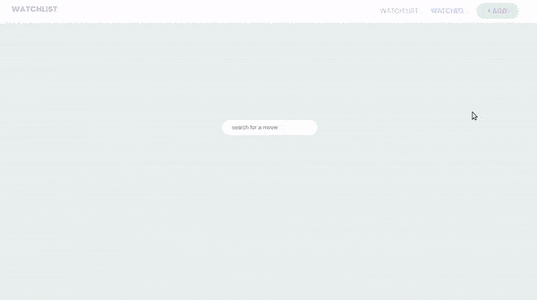

### Create a Movie Watchlist with React Hooks, Context API and localStorage

> In this tutorial we'll be creating a movie watchlist using React, implementing **React Hooks**, **Context API**, **storing data in localStorage** and **fetching data** from an external **API** (The Movie Database).

<br>

##### the tutorial: [Movie Watchlist](https://youtu.be/1eO_hNYzaSc)

<br>

## Useful links: 🐖

[fontawesome](https://fontawesome.com/docs/web/use-with/react/)

<br>

#### READ MORE ABOUT .env [Using environment variables in a React applicatio](https://adostes.medium.com/using-environment-variables-in-a-react-application-ac3b6c307373)

<br>
<br>

---

<br>
<br>

## CONTEXT API 🍨

<br>
<br>

#### Now that we have the products showing on the screen when we type something

[]()

<br>

```javascript
<H4>{movie.release_date ? movie.release_date.substring(0, 4) : "-"}</H4>
```

<br>
<br>
<br>

### Before Continuing, this is what we have until now:

- **ResultCards.jsx**

```javascript
import React from "react";
import styled from "styled-components";
import { mobile, mobileM, tablet } from "../responsive";

const Container = styled.div``;

const Grid = styled.div``;
const ResultCard = styled.div`
  padding: 20px;
  background: #f8f8f8c5;
  padding: 20px;
`;
const ImgBox = styled.div`
  width: 100%;

  img {
    margin: 10px 0 10px 0;
    width: 70%;
    min-height: auto;
    object-fit: cover;
    /* border-radius: 5rem; */
  }
`;
//
const H3 = styled.h3`
  padding: 10px 0 10px 0;
  font-weight: 100;
  font-size: calc(10px + 1.1vmin);
  font-family: "RobotoBlack";
  color: rgb(189, 212, 197);
`;
const H4 = styled.h3`
  font-weight: 100;
  font-size: calc(10px + 1vmin);
  font-family: "Poppins-Light";
  color: rgb(189, 212, 197);
`;
//
//
//
const Controls = styled.div``;

//
const Button = styled.button`
  margin-top: 10px;
  padding: 10px 26px;
  background-color: #9dcebb55;
  color: #a17cc444;

  border-radius: 50px;
  text-transform: uppercase;
  font-weight: 700;
  display: inline-block;
  border: none;
  font-size: calc(8px + 1vmin);
  transition: all 0.3s ease;
  line-height: 1.1;
  &:hover {
    background-color: #9db6ac7b;
    color: #b6b6b6;
  }
`;

const ResultCards = ({ movie }) => {
  return (
    <Container>
      <Grid>
        <ResultCard>
          {movie.poster_path ? (
            <ImgBox>
              {" "}
              
            </ImgBox>
          ) : (
            <div className="filler-poster"></div>
          )}

          <H3>{movie.title}</H3>
          <H4>
            {movie.release_date ? movie.release_date.substring(0, 4) : "-"}
          </H4>
          {/* the button to add to the wtchlist */}
          <Controls>
            <Button>add to watchlist</Button>
          </Controls>
        </ResultCard>
      </Grid>
    </Container>
  );
};

export default ResultCards;
```

<br>
<br>

##### Add.jsx

```javascript
import React, { useState } from "react";
import styled from "styled-components";
import { mobile, mobileM, tablet } from "../responsive";
import ResultCards from "./ResultCards";

//
const { REACT_APP_TMDB_KEY } = process.env;
//
//

const AddPage = styled.div`
  width: 100vw;
  min-height: 100vh;
  padding: 0 0 100px 0;
  display: flex;
  justify-content: center;
  align-items: center;
`;
const Container = styled.div``;

//
//
const AddContent = styled.div`
  width: 100vw;
  min-height: 4vh;
  padding: 0px 0 20px 0;
  text-align: center;
`;

//
const Ul = styled.ul`
  padding: 5em 7.5em;
  display: grid;
  grid-gap: 2em;
  grid-template-columns: repeat(auto-fit, minmax(260px, 1fr));
`;
//
//
const InputWrapper = styled.div``;
const Input = styled.input`
  padding: 10px 26px;
  border-radius: 5rem;
  border: 0;
`;

//
//
export const Add = () => {
  //
  //
  const [query, setQuery] = useState("");
  const [results, setResults] = useState([]);
  //
  const onChange = (e) => {
    e.preventDefault();
    //
    //
    setQuery(e.target.value);
    //
    //API
    fetch(
      `https://api.themoviedb.org/3/search/movie?api_key=${REACT_APP_TMDB_KEY}&language=en-US&page=1&include_adult=false&query=${e.target.value}`
    )
      .then((res) => res.json())
      .then((data) => {
        // if there is not errors, then show results
        if (!data.errors) {
          setResults(data.results);
          console.log(data);
        } else {
          // if there are errors, show empty array
          setResults([]);
        }
      });
  };
  //
  return (
    <>
      <AddPage>
        <Container>
          <AddContent>
            <InputWrapper>
              <Input
                type="text"
                placeholder="search for a movie"
                value={query}
                onChange={onChange}
              />
            </InputWrapper>
            {/* 
            
            
            */}
            {results.length > 0 && (
              <Ul className="results">
                {results.map((movie) => (
                  <li key={movie.id}>
                    <ResultCards movie={movie} />
                  </li>
                ))}
              </Ul>
            )}
          </AddContent>{" "}
        </Container>
      </AddPage>
    </>
  );
};
```

<br>
<br>

---

<br>
<br>

## CONTEXT API 🍌

- What we are going to build now is called the **store** , the **store** will hold all the state data, **the store holds the object which holds the application state data**

- After that we will need the **reducer**

<br>

#### Let's implement the watchList page and button, for this we are going to use the Context API so that we can reach this from everywhere in the project.

<br>

> We do this because the only way we can reach the data in all the components is through **props** but if we do it with it, it will take a lot of time, so that is why we are going to use **context api**

<br>

### Create a new folder (inside the src) and call it

- context

- inside the context folder, create a new file and call it: **GlobalState.js**

<br>

#### 1. Import the following:

```javascript
import React, { createContext, useReducer, useEffect } from "react";
```

<br>

#### 2. Handle the initial state

- the first thing you have to do when working with context api, is making an **initial value**

```javascript
const initialState = {
  //a. at the beginning we have nothing, its an empty array
  watchlist: [],
  //
  // b. then we will make the 'watched' component
  // its also going to be empty
  watched: [],
};
```

<br>

#### 3. Create Context

```javascript
//c. CREATE CONTEXT
export const GlobalContext = createContext(initialState);
```

<br>

#### 4. Now in order to provide this context we need to use something called <u>Provider</u> , which basically allow us to access this global context from other variables

<br>

```javascript
export const GlobalProvider = (props) => {
  // 5 here we will set up the stuff to make it functional
};
```

<br>

#### 5. Make the Provider Functional

##### 🔴 at this point we will have an error, because we don't have yet the <u>AppReducer</u>, thats why it will tell that AppReducer is undefined.

```javascript
export const GlobalProvider = (props) => {
  //
  const [state, dispatch] = useReducer(AppReducer, initialState);
};
```

<br>
<br>

#### This is what we have until now:

```javascript
//1
import React, { createContext, useReducer, useEffect } from "react";
//
//2
const initialState = {
  //1 at the beginning we have nothing, its an empty array
  watchlist: [],
  //
  // 2. then we will make the 'watched' component
  // its also going to be empty
  watched: [],
};
//
//
//3 CREATE CONTEXT
export const GlobalContext = createContext(initialState);

//
//4 provider is going to allow us to access this global context from other variables

export const GlobalProvider = (props) => {
  const [state, dispatch] = useReducer(AppReducer, initialState);
};
```

<br>
<br>

## The Reducer

#### How do actions and reducers Work?

> In Redux, a reducer is a pure function that takes an action and the previous state of the application and returns the new state. The action describes what happened and it is the reducer's job to return the new state based on that action. It may seem simple, but it does have to be a pure function with no side effects.

<br>

#### 6. Create the AppReducer file inside the <context> folder

- AppReducer.js

##### The Reducer is basically a function that returns some state data, this basically describes how your state is transfered into the next state

- In other words, the **reducer** will tell the **store** what to do with the data

> **(actions are objects that tells the reducer how to change the state)**

<br>

```javascript
export default (state, action) => {
  // here we are dispatching a type, that then passes it to the reducer here
  switch (action.type) {
    default:
      return state;
  }
};
```

<br>

##### import the AppReducer.js inside the GlobalState.js

```javascript
import { AppReducer } from "./AppReducer";
```

<br>

## [Provider](https://react-redux.js.org/api/provider)

> The **< Provider >** component makes the Redux store available to any nested components that need to access the Redux store.

<br>

#### 7. With the GlobalContext.Provider, we will wrap all of the elements of the application, so that we can access the global context from every component

```javascript
export const GlobalProvider = (props) => {
  // 5
  const [state, dispatch] = useReducer(AppReducer, initialState);

  // 7 wrap with the GlobalContext.Provider all of the elements of the application
  // so that we can access the global context from every component
  return <GlobalContext.Provider>{props.children}</GlobalContext.Provider>;
  //
  //
};
```

<br>

#### 8. Provide a value so that they are available from our provider, so inside here we want to provide:

- watchlist:

```javascript
 value={{ watchlist: state.watchlist }}
```

<br>

#### So its basically returning the <u>watchlist</u> from the state, and then we will also want to provide it with the <u>watched:</u>

```javascript
// 7 wrap with the GlobalContext.Provider all of the elements of the application so that we can access the global context from every component
return (
  <GlobalContext.Provider
    value={{ watchlist: state.watchlist ✋ , watched: state.watched ✋}}
  >
    {props.children}
  </GlobalContext.Provider>
);
```

<br>
<br>

## Actions

> The action describes what happened and it is the reducer's job to return the new state based on that action. It may seem simple, but it does have to be a pure function with no side effects.

<br>
