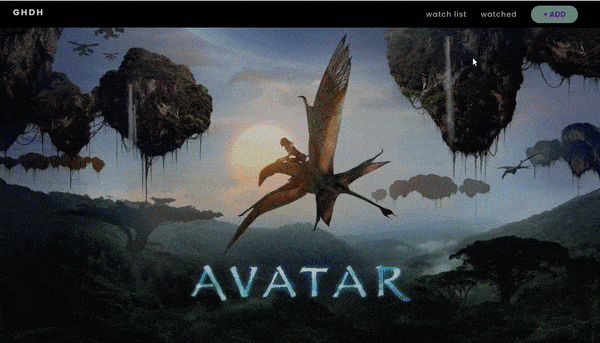

### Create a Movie Watchlist with React Hooks, Context API and localStorage

> In this tutorial I will be creating a movie watchlist using React, **React Hooks**, **Context API**, **storing data in localStorage** and **fetching data** from an external **API** (The Movie Database).

 

##### ⚠️ This app isn't responsive, as the main goal was to refresh my knowledge in react context & API's

 

 
 

---

 
 

#### Branches

 

##### [ 1-setup-router-api-configuration](https://github.com/nadiamariduena/movie-watchlist-reacthooks-context-api/tree/1-setup-router-api-configuration)

##### [2-context-api-setup-button-disabled-when-saving](https://github.com/nadiamariduena/movie-watchlist-reacthooks-context-api/tree/2-context-api-setup-button-disabled-when-saving)

##### [3-saving-to-localstorage-access-context-buttons-disbled](https://github.com/nadiamariduena/movie-watchlist-reacthooks-context-api/tree/3-saving-to-localstorage-access-context-buttons-disbled)

##### [4-counter](https://github.com/nadiamariduena/movie-watchlist-reacthooks-context-api/tree/4-counter)
