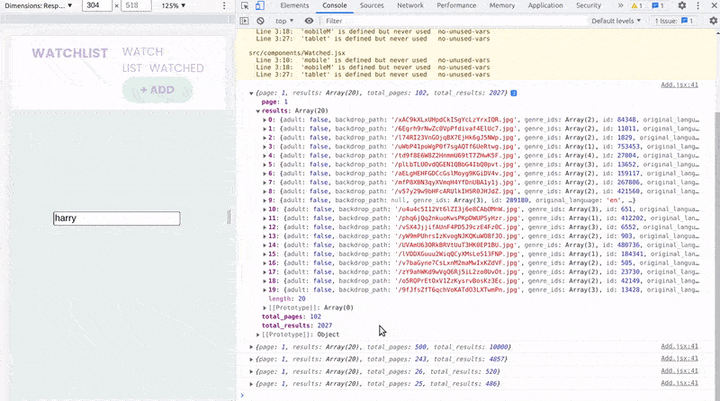
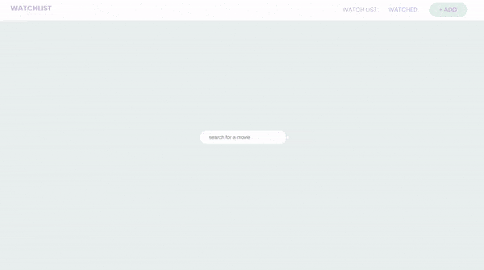
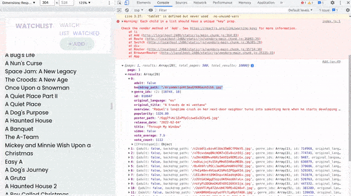

### Create a Movie Watchlist with React Hooks, Context API and localStorage

> In this tutorial we'll be creating a movie watchlist using React, implementing **React Hooks**, **Context API**, **storing data in localStorage** and **fetching data** from an external **API** (The Movie Database).

<br>

##### the tutorial: [Movie Watchlist](https://youtu.be/1eO_hNYzaSc)

<br>

## Useful links: 🐖

[fontawesome](https://fontawesome.com/docs/web/use-with/react/)

<br>

#### READ MORE ABOUT .env [Using environment variables in a React applicatio](https://adostes.medium.com/using-environment-variables-in-a-react-application-ac3b6c307373)

<br>
<br>

---

<br>
<br>

# 🥭

#### 1. Start by requesting the API from this link: [themoviedb.org](https://www.themoviedb.org/settings/api)

<br>

- Once you sign up, go to the settings of your account , then on the left bar you will find the API

<br>

##### 2. Install react-router-dom

> npm i react-router-dom ✋

<br>

##### 3. Copy and paste the css styles from the official repo, so that we dont waste time on it.

##### [styles](https://github.com/MattDobsonWeb/movie-watchlist-react/blob/master/src/App.css)

<br>

##### 4. Download the fontawesome "lib" folder from the official repo

<br>
<br>

---

<br>
<br>

## Lets get started 👾

#### Create the components folder

<br>

##### Create some pages:

- **Watchlist** (will be the **main page**)

##### Inside the <u>WatchList</u> page, type rafce to create a template, do the same with the next pages: <u>Add.jsx, Watched.jsx, Header.jsx</u>

```javascript
import React from "react";

const WatchList = () => {
  return <div>WatchList</div>;
};

export default WatchList;
```

<br>
<br>

### The header

- This will be the basic form the tutorial, soon I will adapt it with styled components.

<br>

```javascript
import React from "react";
import { Link } from "react-router-dom";

const Header = () => {
  return (
    <div>
      <div className="container">
        <div className="inner-content">
          <div className="brand">
            <Link to="/">Watch</Link>
          </div>
          {/* ---- */}
          <ul className="nav-links">
            <li>
              <Link to="/">Watch list</Link>
            </li>
            <li>
              <Link to="/watched">Watched</Link>
            </li>
            <li>
              <Link to="/add" className="btn">
                + Add
              </Link>
            </li>
          </ul>
        </div>
      </div>
    </div>
  );
};

export default Header;
```

<br>
<br>
<br>

## Routing

<br>

##### 🔴 With the updating of the **react-router-dom** you will have some errors when setting up the following, but if you remove all the react related dependencies and grab it from a project of 3 months ago, it will work fine, the reason for that is that this tutorial ways created before such update take place, therefore the errors

<br>

- So delete the old react related and add this one:

```javascript
    "react": "^17.0.2",
    "react-dom": "^17.0.2",
    "react-icons": "^4.3.1",
    "react-player": "^2.9.0",
    "react-router-dom": "^5.3.0",
    "react-scripts": "4.0.3",
```

<br>
<br>

## The Routes Setup ✋

<br>

```javascript
import { BrowserRouter as Router, Switch, Route } from "react-router-dom";
import "./App.css";
import "./lib/font-awesome/css/all.min.css";
//
//
//

import Header from "./components/Header";
import WatchList from "./components/WatchList";
import Watched from "./components/Watched";
import Add from "./components/Add";
//
//
//
function App() {
  return (
    <Router>
      <Header />
      <div className="page">
        <Switch>
          {/* Watchlist is the Home page */}
          <Route exact path="/" component={WatchList} />
          <Route path="/watched" exact component={Watched} />
          <Route path="/add" exact component={Add} />
          {/* <Route path="/product/:id" component={ProductScreen} /> */}
          <Route path="/*" component={WatchList} />
        </Switch>
      </div>
    </Router>
  );
}

export default App;
```

<br>
<br>

### Setting up the Add page

- Here is where we will handle the state and also where we will fetch the data coming from the api

<br>

###### the state

```javascript
// 1
import React, { useState } from "react";
//
const Add = () => {
  //
  //2
  const [query, setQuery] = useState("");
  //
 //5
  const onChange = () => {};
  //
  //
  //
  // 3 add the value
   value={query}
//
// 4 add the function on change
  onChange={onChange}
  //
  //like so
   <Input
                type="text"
                placeholder="search for a movie"
                value={query}
                onChange={onChange}
              />
```

<br>
<br>

```javascript
import React, { useState } from "react";
import styled from "styled-components";
import { mobile, mobileM, tablet } from "../responsive";

const AddPage = styled.div`
  width: 100vw;
  height: 100vh;
  display: flex;
  justify-content: center;
  align-items: center;
`;
const Container = styled.div``;
const AddContent = styled.div``;
const InputWrapper = styled.div``;
const Input = styled.input`
  padding: 10px 26px;
  border-radius: 5rem;
  border: 0;
`;

//
//
const Add = () => {
  //
  //
  const [query, setQuery] = useState("");

  //
  const onChange = (e) => {
    e.preventDefault();
    //
    //
    setQuery(e.target.value);
  };
  //
  return (
    <>
      <AddPage>
        <Container>
          <AddContent>
            <InputWrapper>
              <input
                type="text"
                placeholder="search for a movie"
                value={query}
                onChange={onChange}
              />
            </InputWrapper>
          </AddContent>
        </Container>
      </AddPage>
    </>
  );
};

export default Add;
```

<br>
<br>

### The Api

- Go to the api website [TMDB](https://developers.themoviedb.org/3/getting-started/introduction) and look in the side bar, for[ SEARCH ](https://developers.themoviedb.org/3/search/search-companies)

- Then click again in side bar, for **search the movie**

### get/search/movie

<br>

#### 🔴 Remember:

> You need to request the API key, you will have to fill a form about why do and in what do you want to use, after that you will receive your api in your email, or just refresh the page

<br>

#### Once you have the API, Create a .env.local and store your API there like so:

```javascript
REACT_APP_TMDB_KEY=long api code here
```

<br>

#### ⚠️ After you add the API, restart the app

<br>
<br>

#### Now what we want is that every time we type something inside the search bar, we want to make a fetch request

##### 21:00 [Create a Movie Watchlist with React Hooks, Context API and localStorage](https://youtu.be/1eO_hNYzaSc)

<br>
<br>

# 🌈

### Check the example of the API page to see how it should be implemented

[get/search/movie](https://developers.themoviedb.org/3/search/search-movies)

##### example:

```javascript
https://api.themoviedb.org/3/search/movie?api_key=<<api_key>>&language=en-US&page=1&include_adult=false
```

<br>

### Use it in our project:

#### 1 adding the api to be fetched

```javascript
    setQuery(e.target.value);
    //
    //API
    fetch(`https://api.themoviedb.org/3/search/movie?api_key= API * GOES * HERE`);
  };
  //
  return (
```

<br>
<br>

#### 2 Use the variable you have inside the <u>.env.local</u>

- You need to have your api code there (inside the variable)

```javascript
      `https://api.themoviedb.org/3/search/movie?api_key=${process.env.REACT_APP_TMDB_KEY}`

  };
```

<br>

#### 3. Add the language to the end point of the api <u>&language=en-US</u>

```javascript
`https://api.themoviedb.org/3/search/movie?api_key=${process.env.REACT_APP_TMDB_KEY}&language=en-US`;
```

<br>

#### 4. Add how many pages, to the end point of the api <u>&page=1</u>

```javascript
`https://api.themoviedb.org/3/search/movie?api_key=${process.env.REACT_APP_TMDB_KEY}&language=en-US&page=1`;
```

<br>

#### ⚠️ 5. Prevent it to show adult movies <u>&include_adult=false</u>

```javascript
`https://api.themoviedb.org/3/search/movie?api_key=${process.env.REACT_APP_TMDB_KEY}&language=en-US&page=1&include_adult=false`;
```

<br>
<br>

#### 🐖 6. And here we link it to our search input <u>&query=${e.target.value}</u>

```javascript
`https://api.themoviedb.org/3/search/movie?api_key=${process.env.REACT_APP_TMDB_KEY}&language=en-US&page=1&include_adult=false&query=${e.target.value}`;
```

<br>

### the promise 💍

> Since its data coming from an extern link, we need to have some sort of security in case something goes wrong (bad internet connection... etc)

#### 7.

```javascript
  fetch(
      `https://api.themoviedb.org/3/search/movie?api_key=${process.env.REACT_APP_TMDB_KEY}&language=en-US&page=1&include_adult=false&query=${e.target.value}`
    ).then(inside this promise we will return the result in format json);
```

<br>

```javascript
fetch(
  `https://api.themoviedb.org/3/search/movie?api_key=${process.env.REACT_APP_TMDB_KEY}&language=en-US&page=1&include_adult=false&query=${e.target.value}`
).then((res) => res.json());
```

<br>

#### 8. return the data

- how to

```javascript
fetch(
  `https://api.themoviedb.org/3/search/movie?api_key=${process.env.REACT_APP_TMDB_KEY}&language=en-US&page=1&include_adult=false&query=${e.target.value}`
).then((res) => res.json()).then(return the data)
```

<br>

- implemented

```javascript
fetch(
  `https://api.themoviedb.org/3/search/movie?api_key=${process.env.REACT_APP_TMDB_KEY}&language=en-US&page=1&include_adult=false&query=${e.target.value}`
)
  .then((res) => res.json())
  .then((data) => {
    console.log(data);
  });
```

<br>

# 🔴

#### It gave me the following error when consologin to see the result of the movies

```javascript
Invalid API key: You must be granted a valid key

```

- I couldnt get any result when typing harry potter for example, instead i got that error above

<br>

#### I suspected the .env.local but first i wanted to try most of possibilities

- looking for type errors

- searching for the error in the official page

<br>

[The Movie Database Support](https://www.themoviedb.org/talk/5f93fc79ed28b90042b28c42)

[Append To Response](https://developers.themoviedb.org/3/getting-started/append-to-response)

<br>

- searching for the error in the stack overflow page

[the moviedb url ending point not working?](https://stackoverflow.com/questions/56775797/the-moviedb-url-ending-point-not-working)

# 🌈

#### BUt since its not the first time I have encountered issues when working with API's, I suspected the .env.local

- So i removed the variable and I added the key directly then i got the results

<br>

```javascript
//API
fetch(
  `https://api.themoviedb.org/3/search/movie?api_key= LONG CODE HERE&language=en-US&page=1&include_adult=false&query=${e.target.value}`
)
  .then((res) => res.json())
  .then((data) => {
    console.log(data);
  });
```

<br>

[]()

### The reason of the issue

- a space inside the .env variable

- the .env.local or .env is not in the root directory **(was my case)**

<br>

#### READ MORE ABOUT .env [Using environment variables in a React applicatio](https://adostes.medium.com/using-environment-variables-in-a-react-application-ac3b6c307373)

<br>
<br>

---

<br>

### Now its working perfectly:

```javascript
import React, { useState } from "react";
import styled from "styled-components";
import { mobile, mobileM, tablet } from "../responsive";

//
const { REACT_APP_TMDB_KEY } = process.env;
//
//

const AddPage = styled.div`
  width: 100vw;
  height: 100vh;
  display: flex;
  justify-content: center;
  align-items: center;
`;
const Container = styled.div``;
const AddContent = styled.div``;
const InputWrapper = styled.div``;
const Input = styled.input`
  padding: 10px 26px;
  border-radius: 5rem;
  border: 0;
`;

//
//
export const Add = () => {
  //
  //
  const [query, setQuery] = useState("");

  //
  const onChange = (e) => {
    e.preventDefault();
    //
    //
    setQuery(e.target.value);
    //
    //API
    fetch(
      `https://api.themoviedb.org/3/search/movie?api_key=${REACT_APP_TMDB_KEY}&language=en-US&page=1&include_adult=false&query=${e.target.value}`
    )
      .then((res) => res.json())
      .then((data) => {
        console.log(data);
      });
  };
  //
  return (
    <>
      <AddPage>
        <Container>
          <AddContent>
            <InputWrapper>
              <Input
                type="text"
                placeholder="search for a movie"
                value={query}
                onChange={onChange}
              />
            </InputWrapper>
          </AddContent>
        </Container>
      </AddPage>
    </>
  );
};
```

<br>
<br>

### Now we need to store our results, and for that we need to create another state

<br>

##### 1. for initial state, we will have an array of results and it will be an empty array []

```javascript
const [results, setResults] = useState([]); //array of results ([])
```

<br>

##### 2. Now lets check if there is any errors inside the promise when fetching the data

```javascript
    //API
    fetch(
      `https://api.themoviedb.org/3/search/movie?api_key=${REACT_APP_TMDB_KEY}&language=en-US&page=1&include_adult=false&query=${e.target.value}`
    )
      .then((res) => res.json())
      .then((data) => {
        // if there is not errors, then show results ✋
        if (!data.errors) {
          setResults(data.results);
        } else {
          // if there are errors, show empty array ✋
          setResults([]);
        }
      });
  };
```

<br>
<br>

## .map results

##### If we the results are more than zero, show the results:

```javascript
        </InputWrapper>
        //
            {results.length > 0 && (
              <ul>
                <li>here we will map the results</li>
              </ul>
            )}
          </AddContent>
```

<br>
<br>

#### lets map the movie and then lets create another component, this new component will nest the "card" for the movies

```javascript
{
  results.length > 0 && (
    <ul className="results">
      {results.map((movie) => (
        <li>{movie.title}</li> ✋
      ))}
    </ul>
  );
}
```

<br>

<br>

[]()

<br>
<br>

### Creating the card

-

```javascript
import React from "react";
import styled from "styled-components";
import { mobile, mobileM, tablet } from "../responsive";

const Container = styled.div`
  background: red;
`;

const Grid = styled.div`
  background: green;
`;
const ResultCard = styled.div`
  padding: 20px;
  background: pink;
  padding: 20px;
`;

//
//
const ResultCards = ({ movie }) => {
  return (
    <Container>
      <Grid>
        <ResultCard>
          {movie.poster_path ? (
            
          ) : (
            <div className="filler-poster"></div>
          )}
        </ResultCard>
      </Grid>
    </Container>
  );
};

export default ResultCards;
```

[]()

<br>

#### Here you control the size of the img here w200

```javascript
{
  movie.poster_path ? (
    
  ) : (
    <div className="filler-poster"></div>
  );
}
```

<br>

#### But if you want more control add a div so to nest the img{}

```javascript
const ImgBox = styled.div`
  width: 100%;

  img {
    width: 70%;
    min-height: auto;
    object-fit: cover;
    border-radius: 5rem;
  }
`;

//
//
//
const ResultCards = ({ movie }) => {
  return (
    <Container>
      <Grid>
        <ResultCard>
          {movie.poster_path ? (
            <ImgBox>
              {" "}
              
            </ImgBox>
          ) : (
            <div className="filler-poster"></div>
          )}
        </ResultCard>
      </Grid>
    </Container>
  );
};

export default ResultCards;
```

<br>

[]()
